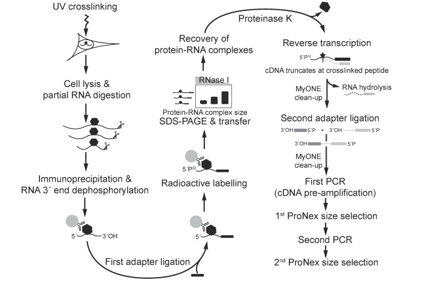

.. _section-about:

General information
===================

About PARANOiD
--------------
PARANOiD (Pipeline for Automated Read ANalysis Of iCLIP Data) is a fully automated pipeline designed to analyze reads generated by iCLIP (https://doi.org/10.1016/j.ymeth.2013.10.011) or iCLIP2 (https://doi.org/10.1016/j.ymeth.2019.10.003) experiments. It provides all essential steps from read preprocessing and alignment to peak calling, and includes several optional downstream analyses such as :ref:`sequence extraction and motif analysis <motif-detection>` and :ref:`RNA subtype analysis <RNA-subtype-analysis>`. PARANOiD offers customization of a large variety of :ref:`options <section-parameters>` and compatible with any reference genome. By default, Bowtie2 is used as aligner, which is suitable for organisms without splicing. Alternatively, users can choose to employ :ref:`STAR <domain>` for splicing-aware alignments. Peak calling is performed by default using PureCLIP, but users may choose to :ref:`disable it <omit-peak-calling>` to obtain raw cross-link position pile ups. To run PARANOiD, users only need to provide :ref:`iCLIP reads <read-file>`, a :ref:`barcode file <barcodes>` and a :ref:`reference <reference>`. An :ref:`annotation file <annotation>` is optional, but recommended.  
PARANOiD is executed via the :ref:`command-line interface <section-example-run>` and processes should be :ref:`distributed to a cluster via a job scheduler <section-cluster>`. While we typically allocate 100 GB RAM and 8 CPUs, resource requirements may vary significantly depending on the dataset. These settings can be adjusted in the :ref:`config file <subsection-files-config>`. The most resource intensive steps in the pipeline are deduplication, alignment using STAR, and peak calling with PureCLIP. When running PARANOiD locally, resource allocations for these steps may need to be accomodated to the systems capacity. When running PARANOiD on large datasets especially deduplication and alignment with STAR will require higher memory allocation.

About CLIP
----------
CLIP (UV-cross-linking and immunoprocipitation) is a method used to study RNA-protein interaction. It takes advantage of the fact that proteins in close proximity to RNA molecules can be covalently cross-linked when irradiated by UV-light at ~ 254 nm. Through immunoprocipitation, a target protein along with its cross-linked RNAs is extracted. After several purification steps and adapter ligation, reverse transcription is performed to generate cDNA, which is then amplified via PCR and sequenced. One of the key advantages of CLIP-based methods is their applicability to both in vivo and in vitro, making them suitable for a wide range of experimental contexts.  
Since the development of CLIP, numerus variants have emerged, each offering specific improvements or optimizations tailored to different research needs. 
Typical use cases for CLIP experiments include the identification of RNA-binding sites, the characterization of RNA-protein interactions, or the investigation of regulatory networks and post-transcriptional gene regulation.

About iCLIP
-----------
One of these CLIP variants is iCLIP (individual-nucleotide resultion CLIP), which takes advantage of the fact that ~80% of all reverse transcriptions stall at the polypeptide still cross-linked to the RNA (https://doi.org/10.1186/gb-2012-13-8-r67). This is utilized to achiece single-nucleotide resultion of the cross-linking site, allowing precise identifictaion of the interaction position upon the RNA. In 2020, iCLIP2 was developed by Buchbender et al. (https://doi.org/10.1016/j.ymeth.2019.10.003) offering  several improvements over the original protocol:

- **Bead based cDNA size selection instead of gel based**
    - Faster, easier and more cost-effective
    
- **Direct ligated of the second adapter to the 3' end instead of by circularization and re-linearisation**
    - Faster and reduces of sample loss

- **Longer barcode and UMI sequences (6-nt barcodes and 9-nt UMIs instead of 4-nt barcodes and 5-nt UMIs)**
    - Increases barcode specificity
    - Reduces likelihood of duplicate UMIs

- **Two-step PCR: initial amplification before size selection followed by a second PCR**
    - cDNAs lost in size selection are already pre-amplified and thus retained in the final library

    
    Overview of the iCLIP2 method. Source: https://doi.org/10.1016/j.ymeth.2019.10.003

About barcodes and UMIs
-----------------------
Barcodes and UMIs (unique molecular identifiers, also known as random barcodes) are short nucleotide sequences added to each read during library preparation. **Barcodes** are experiment- or sample-specific used to distinguish reads from different experiments that were multiplexed for sequencing. Each experiment is assigned a unique barcode sequence, which appears at a defined position within every read from that experiment. By :ref:`providing these sequences <barcodes>`, tools can assign reads to their respective experiments.  
**UMIs** are random nucleotide sequences used to differentiate between true biological duplicates and PCR duplictates. Since UMIs are randomly generated, the probability of two distinct molecules sharingthe same UMI is extremely low. For example, a 9-nt UMI can provide 262144 possible combinations. When 2 reads allign to the exact same genomic position and share the same UMI, they are considered PCR duplicates and all but one are discarded.
Example of barcode sequences:

.. raw:: html

    <ul>
        <li> Random barcode (UMI)</li>
        <li> Experimental barcode</li>
        <li> Actual read</li>
    </ul>

Barcode example for iCLIP:

.. raw:: html

    

        NNN
        XXXX
        NN
        AGTCGCTCGCTCGATAGCTAGCTAGCTAGCT
    

     

Barcode example for iCLIP2:

.. raw:: html

    

        NNNNN
        XXXXXX
        NNNN
        AGTCGCTCGCTCGATAGCTAGCTAGCTAGCT
    

     

Information about how to use PARANOiD with different barcodes can be found :ref:`here <barcode-pattern>`.

About other CLIP methods
------------------------

eCLIP
^^^^^
**eCLIP (enhanced CLIP)** is an enhanced version of iCLIP that was published in `2016 by Van Nostrad et al. <https://doi.org/10.1038/nmeth.3810>`_. It introduces several improvements in the library preparation protocol, such as performing adapter ligation in two distinct steps instead of cirularizing and re-linearizing RNAs which was also adopted in the iCLIP2 protocol. eCLIP enables single-nucleotide resultion of cross-linking events while reducing need for extensive PCR amplification. This leads to fewer discarded reads during PCR deduplication. 
The standard eCLIP protocol produces paired-end reads, where read 1 contains the experimental barcode and read 2 the UMI together with the cross-link site information. Due to this structure, eCLIP reads are not compatible with PARANOiD. To process eCLIP reads, we recommend using tools such as `CLIP-explorer <https://doi.org/10.1093/gigascience/giaa108>`_ or `racoon-clip <https://doi.org/10.1093/bioadv/vbae084>`_, which both support reads generated by iCLIP and eCLIP experiments.

PAR-CLIP
^^^^^^^^
**PAR-CLIP (Photoactivatable-Ribonucleoside-Enhanced Crosslinking and Immunoprecipitation)** is a CLIP variant that improves cross-linking efficiency and resolution by incorporating photoactivatable ribonucleoside analogs into newly synthesized RNAs (https://pmc.ncbi.nlm.nih.gov/articles/PMC4180672/). These analogs form covalent bonds with nearby proteins when irradiated with UV-light at ~365 nm. Metabolic incorporating of these analogs introduces characteristic nucleotide transition (e.g. T to C or G to A) which eneable the precise location of protein-RNA interaction sites. 
However, since these ribonucleosids can be toxic when incorporated into RNA, PAR-CLIP is not suitable for all organisms or cell-types. Due to its mutation-based cross-linking signal, PAR-CLIP reads are not compatible with PARANOiD. To process PAR-CLIP reads, we recommend the `pipeline developed by Marvin Jens <https://doi.org/10.1007/978-1-4939-3067-8_12>`_.

About iCLIP pipelines
---------------------

Besides PARANOiD, several other iCLIP pipelines have been developed and published, each with its own strengths and limitations. Below, we provide a brief overview of the most relevant ones and highlight the gap that PARANOiD aims to fill.

.. _CLIP-explorer:

CLIP-Explorer
^^^^^^^^^^^^^
`CLIP-Explorer <https://doi.org/10.1093/gigascience/giaa108>`_ is a `Galaxy pipeline <https://clipseq.usegalaxy.eu/>`_ for iCLIP and eCLIP data. It's implementation into the Galaxy platform makes it highly accessible, even to users without any informatics background. CLIP-Explorer includes multiple peak callers, each implemented in a separate workflow, and also provides motif detection and RNA subtype analysis.  
However, due to its web-based implementation, datasets must to be uploaded to the Galaxy server, which may be unsuitable for  sensistive data. Additionally, users must either create an account and login to run workflows or host their own GALAXY instance.
The main workflow of CLIP-Explorer is limited to a small set of reference genomes, with hg38 being the primary focus. While CLIP-Explorer offers detailed processing steps, its minimum input requirements are relatively high and not always clearly documented. For example, input reads must be paired-end, and an annotation file together with background reads are mandatory to run any workflows. Furthermore, demultiplexing of reads is handled in a separated workflow, requiring multiple execution steps to complete a full analysis. 

.. _racoon-clip:

racoon_clip
^^^^^^^^^^^
`racoon_clip <https://github.com/ZarnackGroup/racoon_clip>`_ is a workflow for iCLIP and eCLIP data, built using `Snakemake <https://snakemake.readthedocs.io/en/stable/>`_. It covers all essential steps from raw iCLIP reads to cross-link site pileups and peak calling, and includes options to merge replicates. Apart from peak calling, no additional downstream analysis steps are implemented.

.. _fast-iclip:

FAST-iCLIP
^^^^^^^^^^
`FAST iCLIP <https://github.com/ChangLab/FAST-iCLIP>`_ is an iCLIP pipeline designed specifically for the analysis of human (GRCh38) and mouse (GRCm38) genomes. Other genomes are not suported. It relies on outdated dependencies, includiong as Python2, which are no longer maintained and may expose the system to security risks. For this reason, we recommend using alternative pipelines to avoid deprecated software and the associated vulnerabilities.

.. _why-paranoid:

With already existing workflow, why would I use PARANOiD?
^^^^^^^^^^^^^^^^^^^^^^^^^^^^^^^^^^^^^^^^^^^^^^^^^^^^^^^^^
While previously mentioned workflows already provide ways to analyse iCLIP data, we believe that PARANOiD fills an important gap. Many workflow only support a limited set of reference genomes (see :ref:`CLIP-Explorer <CLIP-explorer>` and :ref:`FAST iCLIP <fast-iclip>`). Although this allows for very detailed and tailored analyses, especially when relying on annotations, which unfortunately still lack standardization, it also significantly limits their applicability. 
PARANOiD, on the other hand, is completely species independent and and can easily be adapted to both splicing capable and splicing incapable organisms. This flexibility removes the restrictions imposed by genome-specific workflows.  
CLIP-Explorer requires a variety of inputs, such as paired-end reads, background signal in paired-end format, genome chromosome sizes, and an annotation reference file. While :ref:`racoon_clip <racoon-clip>` has fewer input requirements, it still depends on an annotation file. 
PARANOiD was designed with the idea to require only minimal inputs for its basic analysis. Therefore, only :ref:`iCLIP reads <read-file>`, a :ref:`barcode file <barcodes>` and a :ref:`reference <reference>` are necessary. An :ref:`annotation file <annotation>` is optional making it suitable for organisms with poor or missing annotations. Nevertheless, we recommend providing an :ref:`annotation file <annotation>`, especially when analyzing splicing-capable organisms. Additionally, PARANOiD was developed perform a variety of analyses within a single workflow run, saving time and simplifying execution process. In contrast, CLIP-Explorer divides  processing into 2 workflows: demultiplexing and actual analysis. This increases execution time and requires users to get acustomed with multiple workflows.
While CLIP-Explorer offers additional analyses such as motif and an RNA subtype analysis, racoon_clip only provides cross-linking sites. PARANOiD supports a wide range of downstream analyses which are listed :ref:`here <section-analyses>`. 
All mentioned tools rely on peak calling being performed. While this is a standard procedure when analysing iCLIP data peak calling can fail in certain cases. For example, peak callers struggle when the reference is fully covered by the target protein, as observed in the analysis of RVFV genome coverage by the N-protein in `shalamova et al. <https://doi.org/10.1038/s41467-024-52058-2>`_. To address this, PARANOiD offers the option to :ref:`omit peak calling <omit-peak-calling>` and instead provide a raw pile-up of all cross-linking events. all analyses can then be performed on the pile-ups. To avoid the influence of background noise on these analyses users can determine a :ref:`percentile cutoff <percentile>` that removes peaks with low counts.
Finally, PARANOiD is written in Nextflow, allowing users with informatics knowledge to expand the workflow, whether by adding new analysis modules or integrating alternative alignment or peak calling tools. 