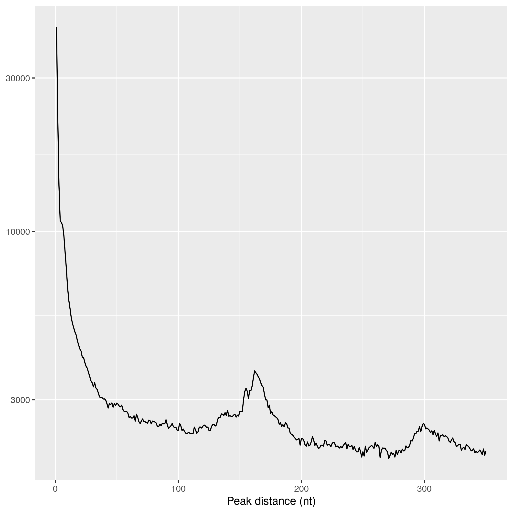

.. _section-output:

PARANOiD Outputs
================

Explanation of all output files generated by PARANOiD

.. _output-alignments:

Alignments
----------

Directory containing deduplicated alignments in ``BAM`` format together with an index file in ``BAM.BAI`` format. BAM files are compressed binary forms of SAM files. SAM/BAM files are tab separated and show one alignment per line.
The information provided in the columns is as follows:
1. Read header
2. Bitwise FLAG
3. Name of reference sequence
4. Position of alignment (1-based)
5. MAPQ-score
6. CIGAR string
7. Name of mate read (shows * if information is not available)
8. Position of mate read (shows 0 if information is not available)
9. Length of alignment on the reference (shows 0 if information is not available)
10. Read sequence (shows * if information is not available)
11. Quality of read sequence (shows * if information is not available)

One of each is generated per sample.

Alignments are included in the :ref:`basic analysis <basic-analysis>`.

Example: 

.. parsed-literal::
    NB501399:129:HLW7VAFX2:3:11409:5471:17963_AAGACACTG     272     1       14572   0       23M     *       0       0       CCACACAGTGCTGGTTCCGTCAC EEEEEEEEEEEAEEEEEEEEEEE NH:i:7  HI:i:4  AS:i:22 nM:i:0
    NB501399:129:HLW7VAFX2:3:11604:9407:1314_TCTGCCCAC      272     1       14747   0       36M     *       0       0       CGGCAGAGGAGGGATGGAGTCTGACACGCGGGCAAA    EEEEEEEEEEEEEEAEEEEEEEEEEEEEEEEEEEEE    NH:i:5  HI:i:4  AS:i:35 nM:i:0
    NB501399:129:HLW7VAFX2:2:11201:6526:7382_TCCCCGACC      272     1       14847   0       40M     *       0       0       AGTGAGGGTGGTTGGTGGGAAACCCTGGTTCCCCCAGCCC        EEEEEEEEEEEAEEEEEEEEEEEEEEEEEEEEEEEEEEEE        NH:i:6  HI:i:3  AS:i:39 nM:i:0
    NB501399:129:HLW7VAFX2:1:11204:3841:14476_GCGATCCCG     272     1       14992   0       37M     *       0       0       GTTGAAGAGATCCGACATCAAGTGCCCACCTTGGCTC   EEEEEEEEEEEEEEEEEEEEEEEEEEEEEEEEEEEEE   NH:i:8  HI:i:5  AS:i:36 nM:i:0
    NB501399:129:HLW7VAFX2:2:11204:16119:17944_CACACCCCG    272     1       14992   0       37M     *       0       0       GTTGAAGAGATCCGACATCAAGTGCCCACCTTGGCTC   EEEEEEEEEEEEEEEEEEEEEEEEEEEEEEEEEEEEE   NH:i:8  HI:i:5  AS:i:36 nM:i:0
    NB501399:129:HLW7VAFX2:1:21211:6880:4260_CCACAACTC      272     1       15923   0       1S25M659N10M    *       0       0       GACCACTTCCCTGGGAGCTCCCTGGACTGAAGGAGA    AEEEEEEEEEEEEEEEEEEEEEEEEEEEEEEEEEEE    NH:i:7  HI:i:3  AS:i:35 nM:i:0

.. _output-cross-link-sites-peak-called:

Peak-called cross-link sites
----------------------------

.. _output-cross-link-sites-raw:

Raw cross-link sites
--------------------

Directory containing unmodified cross-link sites with all background noise retained. Cross-link sites are provided in three different formats, which are separated in one directory each; ``WIG``, ``BIGWIG`` and ``BEDGRAPH``. Each format contains identical data.
These files are included in the :ref:`basic analysis <basic-analysis>`.

WIG (Wiggle)
^^^^^^^^^^^^
Format to represent genome-wide coverage that consists of one line per reference chromosome, with the coverage values listed below each in a tab separated manner.
Column 1 represents the position, while column 2 shows the coverage at the current position.
For each sample, two WIG files are generated - one representing cross-link events on the forward and one on the reverse strand which can be distinguished by their filenames. The number of cross-link events on the reverse strand is shown as negative values.

.. parsed-literal::
    variableStep chrom=reference_1 span=1
    2815    1.0
    3726    1.0
    3895    1.0
    6201    1.0
    6367    1.0
    variableStep chrom=reference_2 span=1
    22  1.0
    31  1.0
    66  1.0
    80  1.0

BIGWIG
^^^^^^
An extension of the previously mentioned WIG format. While WIG uses plain text, BIGWIG uses a binary format to store the data, which reduces file size. Therefore, accessing the data requires specialized software such as IGV. 

BEDGRAPH
^^^^^^^^
A format similar to WIG or BIGWIG. BEDGRAPH files consist of four columns:
1. The chromosome name
2. The start position of the described events
3. The end position of the described events (in PARANOiD, this is the actual cross-link position)
4. Coverage of the described event (negative for reverse strand)

.. parsed-literal::
    DQ375404.1	2814	2815	1
    DQ375404.1	3725	3726	1
    DQ375404.1	3894	3895	1
    DQ375404.1	6200	6201	1
    DQ375404.1	6366	6367	1
    DQ380154.1	21	22	1
    DQ380154.1	30	31	1
    DQ380154.1	65	66	1
    DQ380154.1	79	80	1

Visualization with IGV
^^^^^^^^^^^^^^^^^^^^^^
All provided file types can be easily visualized using the `Integrative Genomics Viewer (IGV) <https://software.broadinstitute.org/software/igv/>`_.
To do so, the reference sequences must first be loaded into IGV. Click on the *Genomes* tab in the top-left corner and select the source of the reference genome.

|IGV overview wig|

The reference track can be used to zoom in, allowing users to see cross-link sites in more detail.

|IGV zoom wig|

.. _output-cross-link-sites-merged:

Cross link sites merged
-----------------------

.. _output-execution-metrics:

Execution metrics
-----------------

Directory containing general execution metrics of the workflow such as: 

1. container_information.txt 
    Container system used to execute the processes, along with the containers used during the workflow execution 
2. execution_information.txt 
    Contains information required to reproduce the results, such as:
        a. Command used for the execution
        b. Directory of PARANOiD
        c. Config file used
        d. Profiles used
        e. Version of Nextflow and PARANOiD
        f. Execution directory
3. parameter_information.txt 
    Contains all parameters used

Execution metrics are included in the :ref:`basic analysis <basic-analysis>`.

.. _output-igv-session:

IGV-session
-----------

An ``XML`` file that can be directly loaded into IGV.
This can be done by clicking on the *Data* tab in the top-left corner and then on *Open Session*. A file browser will open, allowing you to navigate to the PARANOiD output directory and select the *igv-session.xml*. 
This will open a predefined IGV session that includes the reference genome, cross-link sites for all samples (forward and reverse) and the alignment files of all samples.
If the option :ref:`-\-merge_replicates <merge-replicates>` was chosen then only the merged cross-link sites will be shown.
This is included in the :ref:`basic analysis <basic-analysis>`.

.. _output-peak-height-distribution:

Peak height distribution
------------------------

Peak height distribution is included in the :ref:`basic analysis <basic-analysis>`.

.. _output-reference:

Reference
---------

The :ref:`reference sequence <reference>` provided as input. 
The reference file is included in the :ref:`basic analysis <basic-analysis>`.

.. _output-statistics:

Statistics
----------

Statistics are included in the :ref:`basic analysis <basic-analysis>`.

.. _output-strand-distribution:

Strand distribution
-------------------

Strand distribution is included in the :ref:`basic analysis <basic-analysis>`.

.. _output-optional:

Optional analyses
-----------------

.. _output-peak-distance:

Peak distance analysis
^^^^^^^^^^^^^^^^^^^^^^

The :ref:`peak distance analysis <peak-distance-analysis>` produces three output files:
1. Distances table (TSV)  
Contains two columns: 
* Distance  
* Number of peaks with that distance
2. Distance plot (linear scale)
A plot showing distribution of distances with normal y-axis
3. Distance plot (logarithmic scale)
A plot shoing the same data with logarithmic y-axis

The example image below was generated using iCLIP data from `König et al. <https://doi.org/10.1038/nsmb.1838>`_, which is available `here <https://www.ncbi.nlm.nih.gov/geo/query/acc.cgi?acc=GSM630861>`_. iCLIP was performed on HeLa cells with hnRNP C antibodies using a precursor version of the iCLIP protocol. 
The study showed that hnRNP C binds RNAs at characteristic distances of approximately 165 and 300 nucleotides. These distances appear as peaks in the distance analysis (`see fig 3e <https://pmc.ncbi.nlm.nih.gov/articles/PMC3000544/#F3>`_). By performing PARANOiDs peak distance anlysis on this dataset, we were able to recreate these peaks.

    
    Example of peak distance analysis performed by PARANOiD. Shows the distances between hnRNP C binding sites in HeLa cells.

To generate this figure, the following files were used:
1. iCLIP reads:
Downloaded using ``fasterq-dump`` and merged into a single FASTQ file

.. code-block:: shell

    fasterq-dump ERR018282 ERR018283 ERR018284
    cat ERR018282.fastq ERR018283.fastq ERR018284.fastq > hnRNPC.fastq

2. barcodes:
.. parsed-literal::
    
    hnRNPC_rep_1    TG
    hnRNPC_rep_2    TC
    hnRNPC_rep_3    CA

3. Reference genome 
hg18 from https://hgdownload.cse.ucsc.edu/goldenpath/hg18/bigZips/
4. Annotation file 
hg18 annotation from https://www.gencodegenes.org/human/release_18.html

The following command was used to run PARANOiD:

.. code-block:: shell

    nextflow ~/git-projects/PARANOID/main.nf \ 
        --reads data/hnRNPC.fastq \ 
        --barcodes data/hnRNPC_barcodes.tsv \ 
        --reference data/hg18.fa \ 
        --annotation data/gencode.v18.annotation.gtf \ 
        --domain eu \ 
        --barcode_pattern NNXXX \ 
        --mapq 3 \ 
        --omit_peak_calling \ 
        --peak_distance \ 
        --distance 350 \ 
        --merge_replicates \ 
        --output PARANOiD_peak_distance \ 
        -profile slurm,apptainer 

Since the dataset was generated using a precursor iCLIP version, simple barcodes were used: 2 experimental nucleotides followed by 3 random nucleotides. To adapt to these barcodes, the parameter ``--barcode_pattern NNXXX`` was specified. 

